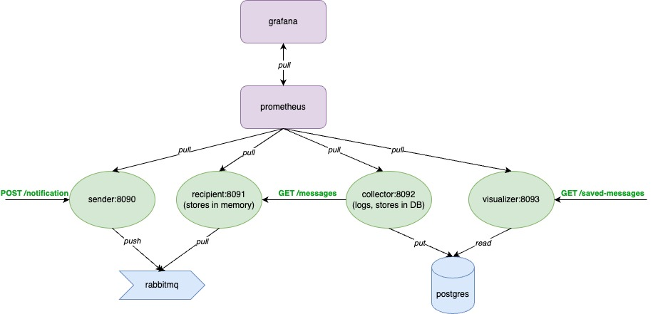

# Microservices Deployment & Monitoring Practice Project

This project is a test environment designed to practice configuring and deploying microservices.    
The microservices are written in **Java** using **Spring Boot** and are integrated via a **message queue** and **database**.    
The deployment environment uses **Docker** and **Kubernetes** to manage containers and orchestration, and the monitoring stack includes **Prometheus** and **Grafana**.    

The project explores different Kubernetes deployment strategies and pod scaling options.

## Project Architecture

## Features

- Microservices architecture using Java + Spring Boot.
- Microservices integrated via message queues.
- Docker-based containerization.
- Kubernetes for orchestration:
    - Various deployment strategies (e.g., Canary Deployment, Blue-Green Deployment).
    - Pod scaling and management.
- Monitoring and alerting:
    - Prometheus for collecting metrics.
    - Grafana for visualization.
    - Custom metrics are introduced to track integration messages between different services

## Prerequisites

Before running this project, make sure you have the following installed:
- [Docker](https://www.docker.com/get-started)
- [Kubernetes (minikube)](https://minikube.sigs.k8s.io/docs/start/?arch=%2Fmacos%2Farm64%2Fstable%2Fbinary+download)

### Notes
- The `HELP.md` file would contain more specific instructions on how to run, scale, and deploy the services, which could include example commands for Kubernetes deployments and Prometheus/Grafana setup.
